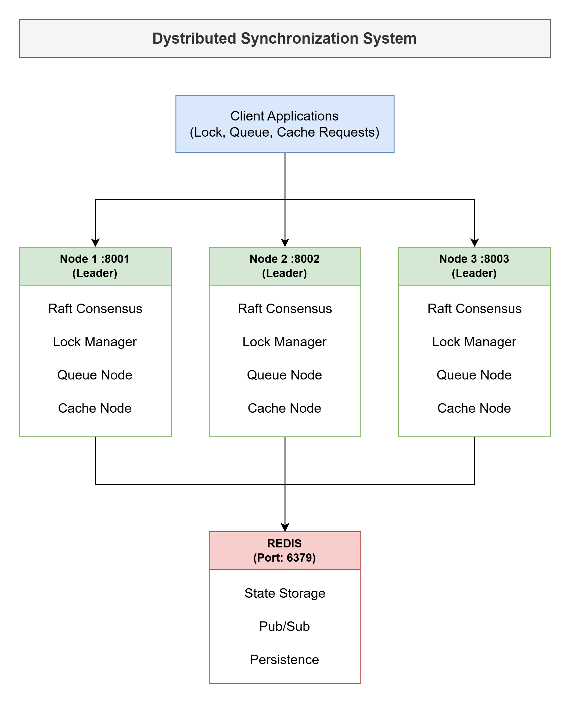

# Distributed Synchronization System

Sistem sinkronisasi terdistribusi yang mengimplementasikan distributed lock manager, distributed queue, dan distributed cache dengan protokol konsensus Raft.

## Fitur Utama

### 1. Distributed Lock Manager
- Implementasi Raft Consensus Algorithm untuk distributed coordination
- Support untuk Shared dan Exclusive Locks
- Deadlock Detection menggunakan wait-for graph
- Automatic deadlock resolution dengan victim selection
- Handle network partition scenarios

### 2. Distributed Queue System
- Consistent Hashing untuk automatic sharding
- Multiple producers dan consumers
- Message Persistence dengan Redis
- Handle node failure tanpa data loss
- At-Least-Once Delivery Guarantee
- Replication factor dan write quorum

### 3. Distributed Cache Coherence
- MESI Protocol untuk cache coherence
- Multiple cache nodes dengan automatic invalidation
- LRU Cache Replacement Policy
- Performance metrics collection
- Cache hit/miss tracking

### 4. Containerization
- Dockerfile untuk setiap komponen
- Docker Compose untuk orchestration
- Support untuk dynamic node scaling
- Environment configuration dengan .env files

## Arsitektur



## Quick Start

### Prerequisites
- Docker 20.10+
- Docker Compose 2.0+
- Python 3.8+ (untuk development lokal)

### Setup & Run

# 1. Clone repository
git clone https://github.com/your-username/distributed-sync-system.git
cd distributed-sync-system

# 2. Copy environment file
cp .env.example .env

# 3. Build dan start cluster
docker-compose -f docker/docker-compose.yml up --build -d

# 4. Check status
docker-compose -f docker/docker-compose.yml ps

# 5. View logs
docker-compose -f docker/docker-compose.yml logs -f

### Verify Deployment

```bash
curl http://localhost:8001/health
curl http://localhost:8002/health
curl http://localhost:8003/health
```

## Documentation

- **[Architecture](docs/architecture.md)** - Arsitektur sistem lengkap dengan diagram
- **[Deployment Guide](docs/deployment_guide.md)** - Panduan deployment dan troubleshooting
- **[API Specification](docs/api_spec.yaml)** - OpenAPI/Swagger documentation
- **[Performance Report](docs/performance_report.md)** - Hasil benchmarking dan analisis

## API Usage

### Distributed Lock

```bash
curl -X POST http://localhost:8001/lock \
  -H "Content-Type: application/json" \
  -d '{"resource": "file1", "owner": "client1", "mode": "S"}'

curl -X POST http://localhost:8001/unlock \
  -H "Content-Type: application/json" \
  -d '{"resource": "file1", "owner": "client1"}'

curl http://localhost:8001/locks
```

### Distributed Queue

```bash
curl -X POST http://localhost:8001/queue/produce \
  -H "Content-Type: application/json" \
  -d '{"queue_name": "tasks", "message": {"task": "process_data", "id": 123}}'

curl -X GET http://localhost:8001/queue/consume/tasks

curl -X POST http://localhost:8001/queue/ack \
  -H "Content-Type: application/json" \
  -d '{"queue_name": "tasks", "message_id": "msg-123"}'
```

### Distributed Cache

```bash
curl -X POST http://localhost:8001/cache \
  -H "Content-Type: application/json" \
  -d '{"key": "user:123", "value": "John Doe"}'

curl http://localhost:8001/cache/user:123

curl http://localhost:8001/cache/metrics
```

## Testing

### Unit Tests

```bash
source venv/bin/activate
pytest tests/unit/ -v
pytest --cov=src tests/unit/
```

### Integration Tests

```bash
docker-compose -f docker/docker-compose.yml up -d
pytest tests/integration/ -v
```

### Performance Tests

```bash
pip install locust
locust -f benchmarks/load_test_scenarios.py --host=http://localhost:8001
```

## Project Structure

```
distributed-sync-system/
├── src/
│   ├── nodes/              # Node implementations
│   │   ├── base_node.py
│   │   ├── lock_manager.py
│   │   ├── queue_node.py
│   │   ├── cache_node.py
│   │   └── run_node.py
│   ├── consensus/          # Raft consensus
│   │   └── raft.py
│   ├── communication/      # Message passing
│   │   └── message_passing.py
│   ├── cache/             # LRU cache
│   │   └── lru_cache.py
│   └── utils/             # Utilities
│       ├── config.py
│       ├── hashing.py
│       ├── redis_client.py
│       └── message_client.py
├── tests/
│   ├── unit/
│   ├── integration/
│   └── performance/
├── docker/
│   ├── Dockerfile.node
│   └── docker-compose.yml
├── docs/
│   ├── architecture.md
│   ├── api_spec.yaml
│   ├── deployment_guide.md
│   └── performance_report.md
├── benchmarks/
│   └── load_test_scenarios.py
├── requirements.txt
├── .env.example
└── README.md
```

## Technology Stack

- **Language:** Python 3.8+ (asyncio)
- **Consensus:** Raft Algorithm (custom implementation)
- **Storage:** Redis 7.0
- **Communication:** HTTP/REST (aiohttp)
- **Containerization:** Docker & Docker Compose
- **Testing:** pytest, locust
- **Cache Protocol:** MESI

## Monitoring

### View Metrics

```bash
curl http://localhost:8001/metrics
curl http://localhost:8001/cache/metrics
curl http://localhost:8001/queue/metrics
```

### View Logs

```bash
docker-compose -f docker/docker-compose.yml logs -f
docker-compose -f docker/docker-compose.yml logs -f node1
docker-compose -f docker/docker-compose.yml logs | grep ERROR
```

## Troubleshooting

### Common Issues

Nodes can't communicate:
```bash
docker network inspect distributed-sync-system_dist_network
docker-compose -f docker/docker-compose.yml restart
```

Redis connection error:
```bash
docker logs redis
docker-compose -f docker/docker-compose.yml restart redis
```

Split brain (multiple leaders):
```bash
docker-compose -f docker/docker-compose.yml restart
```